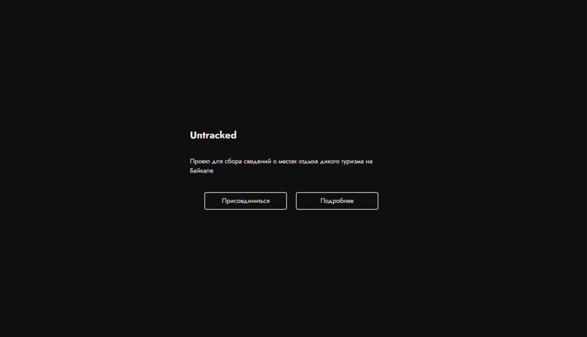

## Сервис для сбора данных от пользователей о местах дикого туризма на Байкале

Проект был выполнен в рамках прохождения учебной практики.

**Поля формы:**
- Название
- Загрузка фотографий
- Координаты по отметкам на карте - геолокация
- Описание места (стоимость, примечания)
- Координаты с карты

_Приложение создаём и развертываем на Google Script._

## Материалы
- https://www.youtube.com/watch?v=c1AQH4UOmiI
- https://ru.stackoverflow.com/
- https://developers.google.com/apps-script/
- https://developer.mozilla.org/ru/docs/Web

## Запуск
1. Открыть Google Drive и создать директорию.
2. Перейти в директорию и создать Google Apps Script и директорию для хранения фотографий.
3. Внутри среды создать файл `index.html`.
4. Скопировать и вставить содержимое файлов.
5. В файле с расширением `.gs` настроить необходимые поля:

| Параметр           | Значение |
|--------------------|----------|
| **SHEET_URL**      | URL адрес таблицы Google Sheets в режиме редактирования (формата `https://docs.google.com/spreadsheets/d/ID/edit?gid=0#gid=0`, где `ID` нужно заменить на ваш) |
| **PLACE_NAME** **PLACE_TYPE** **CHECKING** **COMMENT** **REACTION** | Названия листов в таблице |
| **TITLE**          | Заголовок сайта (отображается в адресной строке браузера) |
| **FAVICON**        | Иконка сайта (обязателен формат `.png`) |
| **PHOTOS_FOLDER_NAME** | Название директории, где сохраняются изображения (должно быть уникальным на Google Drive) |
Планируется реализовать api и программу для упаковки данных и аналитики. Также клиентская часть в качестве примера.
